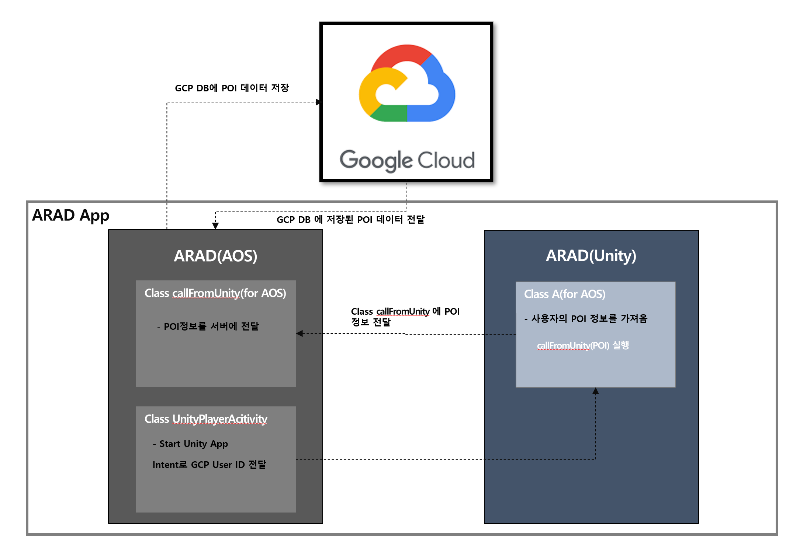
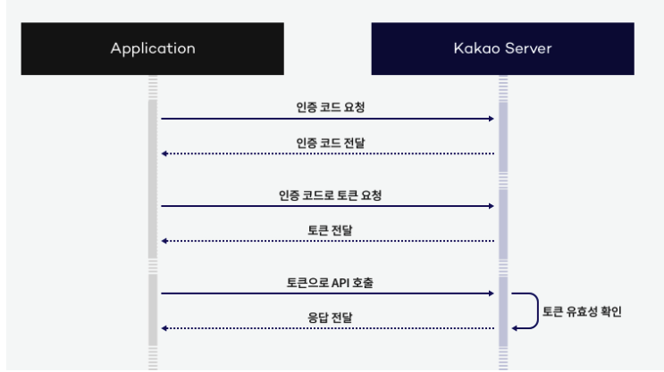

# AR로 즐기는 새로운 앱 테크 App

<h1 align="center">  </h1>

# 프로젝트 소개
### ARAD - AR로 즐기는 새로운 앱 테크 App을 출시하게 되어   Github를 통해 해당 프로젝트에 대한 설명과 구성을 정리했습니다.
  

* ARAD 앱은 유저의 참여에 대한 보상을 제공하는 앱입니다.   
* 이벤트 AR 이미지가 생성된 곳에 촬영을 하면 포인트를 받을 수 있어요.  
* 유저들은 지급 받은 포인트로 상품권이랑 교환할 수 있습니다.   
* 쿠팡 파트너스 및 업체의 AR 광고를 통해 보다 뛰어난 마케팅 사업을 진행할 수 있습니다. 
 
 

# 

# 사용 기술
 

 
   
   
   
  
  

  

 
 

# 구현 기능

* Permission 요청 & 확인   
* 소셜 로그인(카카오, 구글)  
* 안드로이드 13 알림 기능 적용   
* Unity를 안드로이드 프로젝트에 통합(uaal)   
* FCM 푸시   
* GCP 서버와 http 통신(Retrofit2로 구현)   
* 구글 Map 구현(custom thema 적용)   
* UI 구성(Jetpack Navigation & Fragment)   

 

# ARAD 앱 화면
 
<h1 align="center">

| **권한 요청** | **소셜 로그인** | **쿠팡 웹뷰** | **Main 화면** |
|---|---|---|---|
|  |  | | 

| **AR View1** | **AR View2** | **AR View3** | **POI Upload** | 
|---|---|---|---|
|  |  |  | 

 
 

</h1>
   

# URL
깃허브 : https://github.com/rohhyungwoo/ARAD_Project.git \
스토어 : https://play.google.com/store/apps/details?id=com.anyractive.arad_january
  

# 주요 기능

## 1. 서버 송수신

서버와 http 통신을 하여 실시간으로 데이터를 공유합니다\
앱과 서버간의 REST API 통신을 도와주는 라이브러리로 Retrofit2를 사용 했습니다
  

구글 클라우드 플랫폼을 통해 서버를 구축 했습니다. 
앱에서는 사용자의 회원가입 정보와 POI(관심지역정보)를 서버에 저장합니다. 

ARAD에서는 Unity 프로젝트를 통해 개발된 Unity 앱을 사용하는데 유니티 앱은 Cloud의 Database에 저장된 사용자의 ID와 POI 값을 필요로 합니다. 
ARAD AOS앱은 서버와 http 통신으로 데이터를 교환하고 데이터를 유니티 앱에 전달합니다. 
유니티 앱은 컨텐츠를 실행하고 결과 값(POI)를 AOS앱을 통해서 서버에 저장하게 됩니다.  

  
카카오 & 구글 소셜 로그인 기반으로 회원의 고유 ID를 생성하고 보상 및 AR 컨텐츠를 즐기기 위한 데이터를 저장합니다.
아래는 사용자가 촬영한 이미지, 위치 정보, 촬영지 정보가 서버에 업로드 된 모습 입니다.

  
관리자가 사용자가 업로드한 이미지를 가지고 반려, 승인을 판단하여 처리하게 되면\
Client는 서버로 부터 안내 메시지를 받을 수 있습니다.
  

  
안내 메시지를 받는 방법은 Push Token을 구글 파이어베이스를 통해 유저의 고유 푸시 token을 발급받고 Post Man과
자사 서버를 사용해 해당 기능을 구현 했습니다

## 2. AR 컨텐츠 실행
보다 입체적인 AR 이미지를 표현하기 위해 Unity를 통해 개발된 프로젝트를\
기존 안드로이드 앱에 적용하는 Uaal(Unity as a Library)을 사용합니다

 
  
- AR Core 기반 AR 이미지 모델링 
 AR Core란 Google에서 개발한 AR 증강현실 기술입니다  
 사용자의 카메라와 위치에 엑세스 하여 수평면을 찾아, 가상의 객체를 3D 공간에 고정 및 배치합니다

 - AR 이미지 생성 및 관심 위치(POI) 저장 
 카메라와 위치를 기반으로 AR Core가 공간에서 초기 포지션에서 추적 가능한 한 지점을 나타내고 해당 지점을 앵커로 만들어 냅니다 
 또한 getPose를 통해 관심 위치에 대한 좌표값을 알 수 있게 됩니다.

 - Unity 모듈 연동 
 안드로이드에 Unity 프로그램을 라이브러리로 활용 했습니다
   
 
 
  
 Unity 라이브러리를 생성하여 안드로이드 프로젝트 package 경로에 저장합니다.
 이 다음 Unity 라이브러리를 정상적으로 사용하기 위해서는 몇가지 작업을 진행해야 됩니다.

 > app 내부 build.gradle 설정\
gradle.properties 수정\
UnityLibrary 의 build.gradle 수정.\
string.xml 추가\
Maniifest에서 Intent Filter 수정\
ndk 설치 및 경로 추가\
Duplicate 오류 해결\
setting.grandle 파일에 include ':unityLibrary' 추가 \
android:process(:Unity) 추가

 
위 설정이 끝나면 아래 코드를 통해서 Unity Program을 실행 할 수 있습니다 
>startActivity(Intent(this, UnityPlayerActivity::class.java))

 
Uaal 설정하는 방법에 대한 더욱 자세한 내용은 제 블로그를 방문해 주시면 감사합니다.
 

https://velog.io/@romin1027/%EC%95%88%EB%93%9C%EB%A1%9C%EC%9D%B4%EB%93%9C%EC%97%90%EC%84%9C-Uaal-%ED%99%9C%EC%9A%A91

## 3. 소셜 로그인

소셜 로그인은 구글과 카카오에서 제공하는 API를 이용했습니다.  
OAuth를 통해 사용자에게 Access Token을 제공하고 
사용자는 인증 토큰으로 소셜에 접속 합니다. 
사용자는 로그인 플랫폼에 접근 가능한 정보를 요청하고 발급 받습니다. 

| **구글 로그인** | **프로필 이미지 적용** | 
|---|---|
| " |  | 

 
 

# 아키택처
 

# 추가 이미지
 

